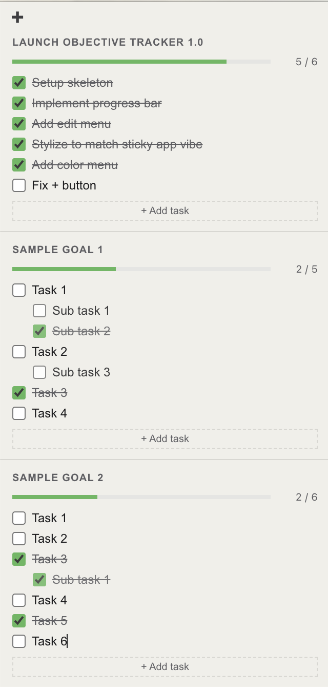
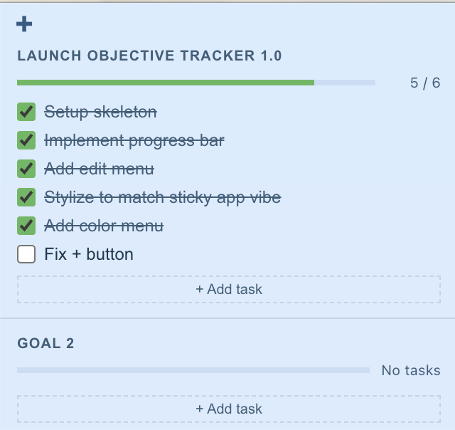
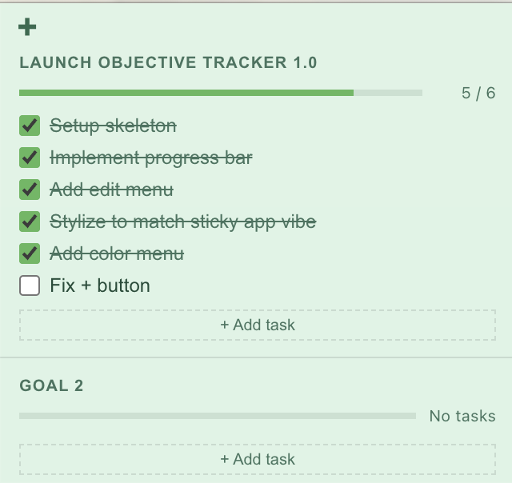

# Objective Tracker

A minimal macOS sticky-note app for tracking objectives with sections, tasks, and sub-tasks.

<div style="display: flex; align-items:center; justify-content: space-around">
  
  <div style="display:flex; flex-direction: column; align-items:center; justify-content: space-between;">
    <br/>
    
  </div>
</div>

## Features

✅ Sections with progress bars<br>
✅ Tasks and sub-tasks with checkboxes<br>
✅ Themeable background colors via the **Color** menu<br>
✅ Persisted state across restarts

## Install

Download the latest `.zip` from [Releases](../../releases), unzip, and drag **Objective Tracker.app** to `/Applications`.

## Development

```
npm install
npm start      # run locally
npm run build  # package for macOS → dist/
```
