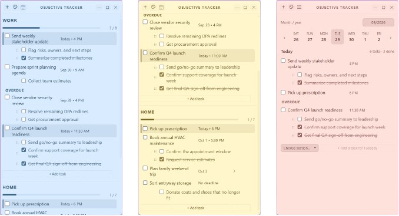

# Objective Tracker

A minimal macOS sticky-note app for tracking objectives with sections, tasks, and sub-tasks.

<p style="text-align:center">
  
</p>

## Features

✅ Toggle between two views: 
<ul>
<li>Section view: displays tasks based on the section they fall under</li>
<li>Day view: displays tasks based on the day they are due</li>
</ul>
✅ Sections with progress bars<br>
✅ Tasks and sub-tasks with checkboxes<br>
✅ Deadlines for tasks<br>
✅ Drag and drop rearrangeability for subtasks<br> 
✅ Minimize and collapsability for sections and tasks<br>
✅ Themeable background colors via the **Color** menu<br>
✅ Persisted state across restarts

## Install
For Windows:<br>
Download the latest `.exe` from [Releases](../../releases)<br>

For macOS:<br>
Download the latest `.dmg` from [Releases](../../releases)<br>

*NOTE:* click "open app anyway" in privacy and security settings

## Development

```
npm install
npm start      # run locally
npm run build:macos  # package for macOS
npm run build:windows # package for Windows 
```
